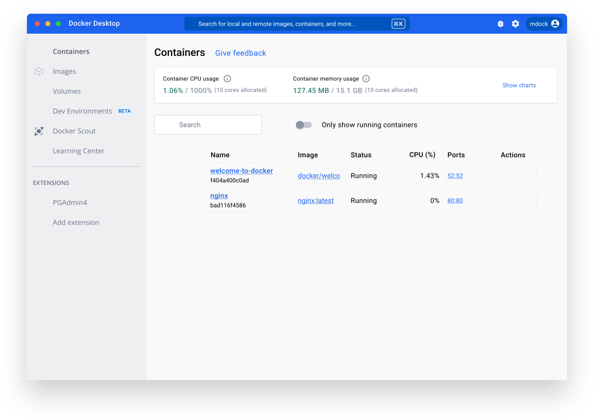
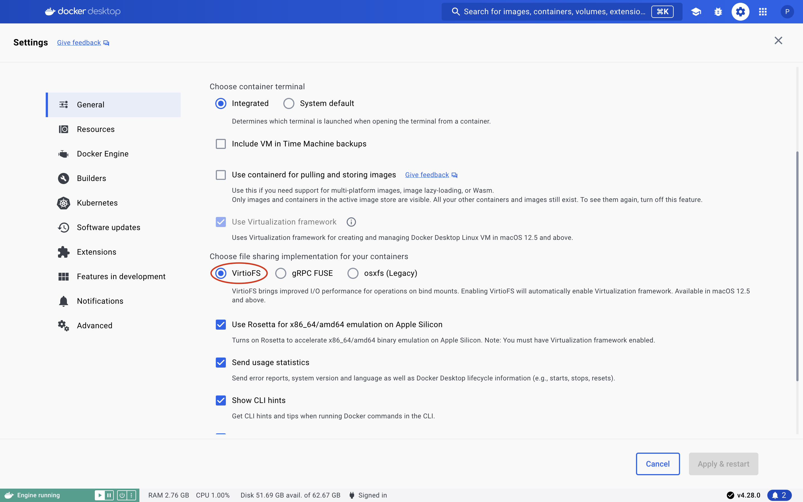

.. _docker_setup:

Setting Up Docker
=================

The ``ben`` and ``mgrp`` modules of this library are both designed to be used in conjunction
with Docker to help make it easier for users to run native versions of code written
in Rust, Juila, R, and C++ without having to go through the trouble of setting up and
installing all of the necessary dependencies. This is super nice for the user since
it makes it easy to work with (mildly limited) versions of a given codebase, and it
makes it nice for the developers since they can be sure that the code will run on
the user's machine with minimal hassle.

lTo set up Docker, navigate to the `Getting Started <https://www.docker.com/get-started/>`_
page on the Docker website and follow the instructions to download and install Docker
desktop (if you are on Linux, just use your package manager to install Docker desktop).

.. image::
    ../_static/images/docker_download.png
    :alt: Docker Desktop Download Page

Once you have Docker installed, you should then be able to open the desktop
client to see something like this:

You may be prompted to set up a Docker account, and while this is generally
recommended, it is not necessary in order to run any of the wrappers in this
repository.

.. note::
    In order to run ``ben`` and ``mgrp`` you will need to make sure that the
    Docker engine is running the entire time. This generally means that you will
    just need for the Docker desktop application to be open, but if you see any
    weird errors about the docker client when trying to work with ``gerrytools``,
    first try to restart the Docker desktop application before doing anything else.

    If you plan on having ``gerrytools`` as a major part of your workflow for the
    foreseeable future, you may want to consider setting up Docker to start on
    boot so that you don't have to worry about the engine being up.

When you have finished installing docker it would be a good idea to make sure that you also
have the ``docker`` python package installed. This can be done with a simple invocation of
``pip install docker``.

MacOS Installation Instructions
-------------------------------

Installation on MacOS is pretty simple. Just make sure to install the Docker desktop
client and then double-check the settings to make sure that VirtioFS is enabled:

Note that you should have Docker Desktop v4.28.0 or later on your machine in order for
the application to run properly.

Windows Installation Instructions
---------------------------------

Installation on Windows is a bit more complicated than on MacOS. If you are working
on a computer that came with Windows 11 pre-installed, you should be able to just
install Docker Desktop and run it without any issues. If you are working on a computer
that upgraded from Windows 10 to Windows 11, you will likely need to enable Virtualization
in the BIOS settings of your computer. 

For anyone w-o has not done this before, this can be a bit intimidating, but in this case,
it is really not that bad. We just need to find one setting and switch the value from
``Disabled`` to ``Enabled``. Depending on the manufacturer of your motherboard, the exact steps
to do this will vary, but in general, you will need to restart your computer and press either
the "Del" or "F2" key to enter the BIOS settings. Once you are in the BIOS settings, you will
look for a setting either called "SVM" or "Intel (VMX) Virtualization Technology" in your
CPU settings and set them to "Enabled." `Here is a link to an excellent visual tutorial on
how to do this on ASUS motherboards. <https://support.salad.com/article/277-enable-virtualization-on-asus-pcs>`_

Once you have enabled virtualization, you should be able to use Docker Desktop without any issues.