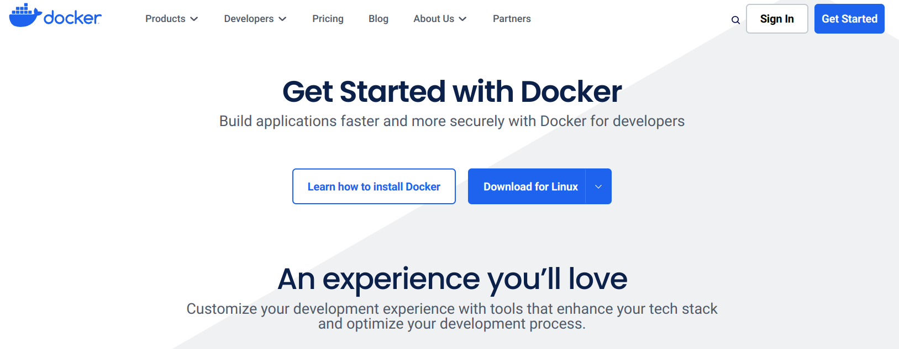

.. _docker_setup:

Setting Up Docker
=================

The ``ben`` and ``mgrp`` modules of this library are both designed to be used in conjunction
with Docker to help make it easier for users to run native versions of code written
in Rust, Juila, R, and C++ without having to go through the trouble of setting up and
installing all of the necessary dependencies. This is super nice for the user since
it makes it easy to work with (mildly limited) versions of a given codebase, and it
makes it nice for the developers since they can be sure that the code will run on
the user's machine with minimal hassle.

lTo set up Docker, navigate to the `Getting Started <https://www.docker.com/get-started/>`_
page on the Docker website and follow the instructions to download and install Docker
desktop (if you are on Linux, just use your package manager to install Docker desktop).

Once you have Docker installed, you should then be able to open the desktop
client to see something like this:

.. image::
    ../_static/images/docker-desktop-hero-v2.svg
    :alt: Docker Desktop Application Screenshot

You may be prompted to set up a Docker account, and while this is generally
recommended, it is not necessary in order to run any of the wrappers in this
repository.

.. note::
    In order to run ``ben`` and ``mgrp`` you will need to make sure that the
    Docker engine is running the entire time. This generally means that you will
    just need for the Docker desktop application to be open, but if you see any
    weird errors about the docker client when trying to work with ``gerrytools``,
    first try to restart the Docker desktop application before doing anything else.

    If you plan on having ``gerrytools`` as a major part of your workflow for the
    foreseeable future, you may want to consider setting up Docker to start on
    boot so that you don't have to worry about the engine being up.