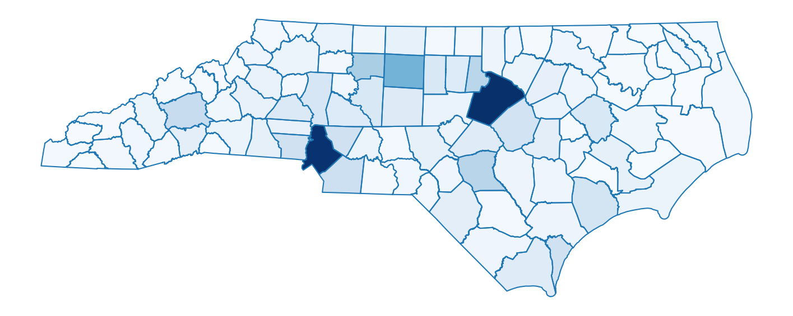

========
Geometry
========

The ``geometry`` module of ``gerrytools`` is designed to make working with
different types of geometries easier. More specifcially, it is designed to
to make combining subdivided geometries and generating a dual graph (which
are key components to the `GerryChain <https://github.com/mggg/gerrychain>`_
workflow) easier.

For this tutorial, please click on the following download link to download the
necessary files:

.. raw:: html 

    

        <a href="https://github.com/peterrrock2/gerrytools-dev/blob/main/docs/source/_static/NC_vtd20.zip", class="download-badge", download>
        NC Shapefile
        </a>
    

     

Dual Graphs
-----------

This method allow us to generate a graph dual to the provided geometric data (a ``GeoDataFrame``)

.. code-block:: python

    vtd_shp = gpd.read_file("data/NC_vtd20/") # North Carolina VTDs
    graph = dualgraph(vtd_shp)
    
Dissolve
--------

This dissolves the geometric data on the column ``by``. We generally use this to
dissolve a set of source geometries (e.g. VTDs, blocks, etc.) to district geometries.
In this case, we'll dissolve our North Carolina VTDs by county, since we don't have a district
assignment column.

.. code-block:: python

    counties = dissolve(
        geometries=vtd_shp,
        by="COUNTYFP20",
        reset_index=True, # defaults to making the result integer-indexed, not the `by` column
        keep=["TOTPOP20"], # Additional columns to keep beyond the geometry and `by` columns. Defaults to []
        aggfunc="sum", # pandas groupby function type when aggregating; defaults to "sum"
    )

For a quick explanation of the parameter, we have:

- ``geometries``:  Set of geometries to be dissolved.
- ``by`` Name of the column used to group objects. In this case, we're dissolving by county.
- ``reset_index`` If true, the index of the resulting GeoDataFrame will be set to an integer
  index as opposed to being indexed by the item in the ``by``, not by. Defaults to True.
- ``keep`` A list of additional columns that we would like to keep beyond the ``geometry``
  and ``by`` columns.
- ``aggfunc`` Is the aggregation function that Pandas groupby will try to call. **Note:**
  the same function is applied to all columns regardless of type.

We can then easily plot the result:

.. code-block:: python

    fig, ax = plt.subplots(figsize=(18,8))
    ax = counties.plot(
        ax=ax,
        column="TOTPOP20",
        cmap='Blues',
    )
    ax = counties.boundary.plot(ax=ax)
    _ = plt.axis('off')

Which will produce:

Of course, remembering all of the proper syntax to make a nice ``matplotlib`` plot can
be a bit tricky, so we have also made a method called :meth:`~gerrytools.plotting.chloropleth`
for producing a similar plot:

.. code-block:: python

    from gerrytools.plotting import choropleth

    counties["SHARE_OF_MAX"] = (
        counties["TOTPOP20"] / counties["TOTPOP20"].max()
    )

    ax = choropleth(
        geometries=counties,
        districts=counties,
        demographic_share_col="SHARE_OF_MAX",
        cmap="Blues",
        district_linecolor="#1F77B4",
        colorbar=False,
        figsize=(18,8),
    )

And this code will produce:

``unitmap`` and ``invert``
--------------------------

.. |rarr| raw:: html

   &rarr;

``unitmap`` creates a mapping from source (smaller) units to target (larger) units.
``invert`` inverts the provided unitmapping, mapping the target (larger) units to
lists of source (smaller) units. Often we would want to do this for blocks |rarr|
VTDs, but here we'll test this on VTDs |rarr| counties.

.. code:: python

    mapping = unitmap((vtd_shp, "GEOID20"), (counties, "COUNTYFP20"))
    inverted_mapping = invert(mapping)

    print(f"mapping['37025008-00']={mapping['37025008-00']}")
    print(f"inverted_mapping[25.0]={inverted_mapping[25.0]}")

Which will output:

.. code-block:: console

    mapping['37025008-00']=25.0
    inverted_mapping[25.0]=['37025008-00', '37025001-10', '37025001-07', '37025001-08',
    '37025002-08', '37025002-09', '37025003-00', '37025012-04', '37025012-03',
    '37025002-06', '37025002-07', '37025002-02', '37025011-01', '37025009-00',
    '37025004-01', '37025012-11', '37025004-08', '37025012-12', '37025012-08',
    '37025012-09', '37025002-03', '37025001-02', '37025001-04', '37025010-00',
    '37025004-03', '37025005-00', '37025012-05', '37025011-02', '37025002-05',
    '37025006-00', '37025012-10', '37025002-01', '37025004-09', '37025007-00',
    '37025012-06', '37025012-13', '37025004-12', '37025004-11', '37025004-13',
    '37025001-11']
