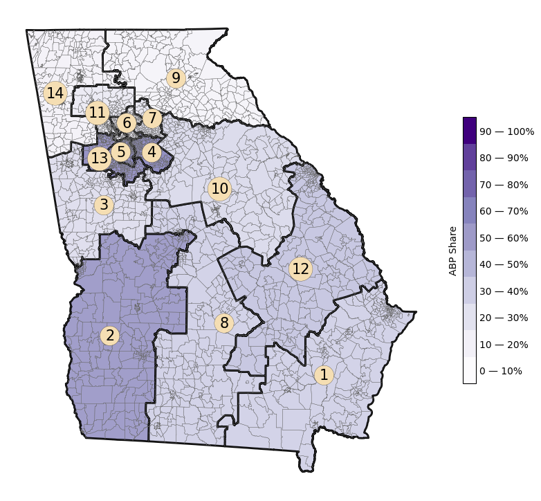
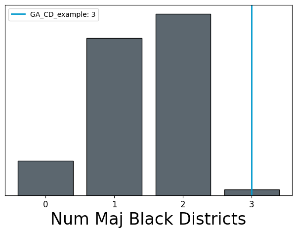
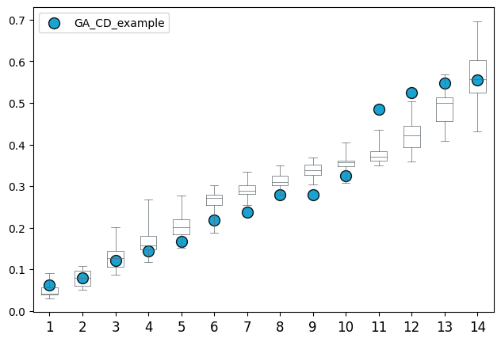
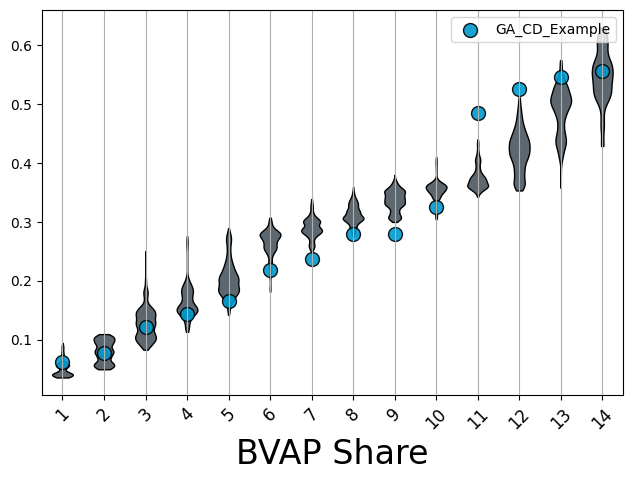
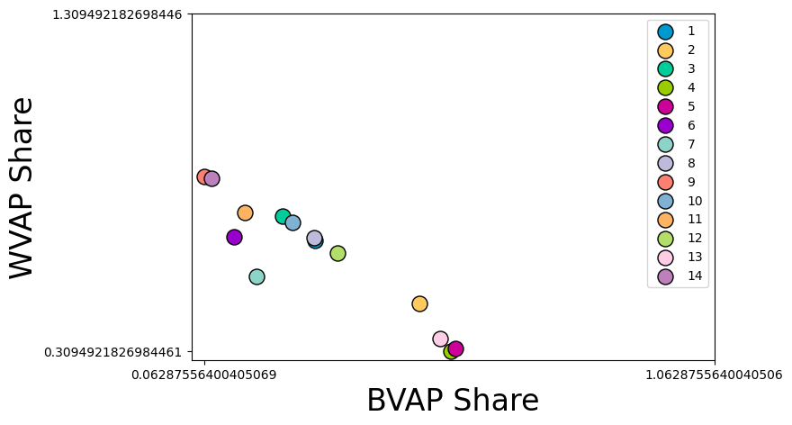

========
Plotting
========

The ``plotting`` module of ``gerrychain`` is designed to provide several convenience
functions for visualizing the results of from a generated ensemble, and to help
us to visualize the findings in terms of the geometry of the state in question.

For this tutorial, we will be working with the following shapefile of the state of
Georgia:

.. raw:: html

    

        <a href="https://github.com/peterrrock2/gerrytools-dev/main/glob/docs/source/_static/GA_CD_example.zip" class="download-badge" download>
            GA Shapefile
        </a>
    

     

You will also need a copy of the county file:

.. raw:: html

    

        <a href="https://github.com/peterrrock2/gerrytools-dev/main/glob/docs/source/_static/ga_county.zip" class="download-badge" download>
            GA County File
        </a>
    

     

Geographic Plotting
-------------------

First, we will need to import all of the necessary modules and load our shapefile:

.. code-block:: python

    from gerrytools.scoring import *
    from gerrytools.plotting import *
    import pandas as pd
    import geopandas as gpd
    from gerrychain import Graph
    import matplotlib.pyplot as plt

    plan = gpd.read_file("data/GA_CD_example")

Within this module, there are functions that allow us to visualize a districting plan,
as well as draw a choropleth for a certain demographic within the plan, or a dot
density map of the plan. 

First we'll start with ``drawplan``. In order to use this, you will need your desired
plan as a shapefile on any units with a dedicated column for districts. This function
also allows us to overlay other geographies on the plan. In this case, we're plotting
a plan for the GA Congressional map, and we'll overlay the plan with Georgia counties. 

This function automatically plots the plan using districtr colors, a list of 33
colors, so if the plan has more than 33 districts, there will be repeats. A user
defined color list can be passed using the ``colors`` argument, which is for the name of
a column that defines color on the shapefile.

.. code-block:: python

    ga_county = gpd.read_file("ga_county.zip")
    ga_county.columns

And we can see that the columns are:

.. code-block:: console

    Index(['NBAPAVAP20', 'FUNCSTAT20', 'STATEFP20', 'BVAP20', 'LOGRECNO', 'AMINVAP20',
        'COUNTYFP20', 'WPOP20', 'STUSAB', 'DOJBVAP20', 'APAMIVAP20', 'COPOP20', 'APAMIPOP20',
        'HVAP20', 'HISP20', 'ASIANPOP20', 'NAMELSAD20', 'NHPIPOP20', 'APBPOP20', 'NAME20',
        'AWATER20', 'ASIANVAP20', 'WVAP20', 'MTFCC20', 'OTHERVAP20', 'CHARITER', '2MOREVAP20',
        'APAPOP20', 'GEOID20', 'SUMLEV', 'CIFSN', '2MOREPOP20', 'CLASSFP20', 'APAVAP20',
        'AMINPOP20', 'INTPTLAT20', 'NWBHPOP20', 'NWBHVAP20', 'TOTPOP20', 'VAP20', 'CSAFP20',
        'GEOCODE', 'COUNTYNS20', 'LSAD20', 'FILEID', 'BPOP20', 'OTHERPOP20', 'NHPIVAP20',
        'ALAND20', 'APBVAP20', 'CBSAFP20', 'INTPTLON20', 'METDIVFP20', 'NBAPAPOP20',
        'COVAP20', 'geometry'], dtype='object')

We will now make a new plan from the original plan that merges all of the congressional
districts of the original plan: 

.. code-block:: python

    new_plan = plan.dissolve(by='CD').reset_index()
    new_plan["CD"]

And this will output:

.. code-block:: console
    
        0     01
        1     02
        2     03
        3     04
        4     05
        5     06
        6     07
        7     08
        8     09
        9     10
        10    11
        11    12
        12    13
        13    14
        Name: CD, dtype: object

We can now use the nice coloring option provided to us by ``gerrytools`` to help us plot
the plan:

.. code-block:: python

    import matplotlib.pyplot as plt
    import gerrytools.plotting.colors as colors
    import numpy as np

    N = len(new_plan)

    dists = new_plan.to_crs("EPSG:3857")
    dists["CD"] = dists["CD"].astype(int)
    dists=dists.sort_values(by="CD")
    dists["colorindex"] = list(range(N))
    dists["color"] = colors.districtr(N)

    ax = drawplan(plan, assignment="CD",overlays=[ga_county])

And this will give us the following image:

.. image:: ../_static/images/drawplan_GA.png
    :width: 400
    :align: center

If you would like to see the colors and their indices, you can print out the 
following view of the dataframe:

.. code-block:: python

    dists[["color", "CD", "colorindex"]]

Which will return:

+----+--------+----------+------------+
|    | color  | CD       | colorindex |
+====+========+==========+============+
| 0  | #0099cd| 1        | 0          |
+----+--------+----------+------------+
| 1  | #ffca5d| 2        | 1          |
+----+--------+----------+------------+
| 2  | #00cd99| 3        | 2          |
+----+--------+----------+------------+
| 3  | #99cd00| 4        | 3          |
+----+--------+----------+------------+
| 4  | #cd0099| 5        | 4          |
+----+--------+----------+------------+
| 5  | #9900cd| 6        | 5          |
+----+--------+----------+------------+
| 6  | #8dd3c7| 7        | 6          |
+----+--------+----------+------------+
| 7  | #bebada| 8        | 7          |
+----+--------+----------+------------+
| 8  | #fb8072| 9        | 8          |
+----+--------+----------+------------+
| 9  | #80b1d3| 10       | 9          |
+----+--------+----------+------------+
| 10 | #fdb462| 11       | 10         |
+----+--------+----------+------------+
| 11 | #b3de69| 12       | 11         |
+----+--------+----------+------------+
| 12 | #fccde5| 13       | 12         |
+----+--------+----------+------------+
| 13 | #bc80bd| 14       | 13         |
+----+--------+----------+------------+

We can also draw a choropleth of a certain demographic across the map. Our
``drawchoropleth`` function takes care of this, so long as you pass a demographic
share column.

You can also pass the column of total counts of any demographic share. This function
plots the map, as well as a colorbar, whose label can be changed the the ``cbartitle``
argument.

.. code-block:: python

    plan["VAP_CD"] = plan.groupby("CD")["VAP"].transform("sum")
    plan["TOTPOP_CD"] = plan.groupby("CD")["TOTPOP"].transform("sum")
    plan["BVAP_SHARE_CD"] = plan["BVAP"]/plan["VAP_CD"]

    districts = plan.dissolve(by="CD").reset_index()
    districts["CD"] = districts["CD"].astype(int)

    choro = choropleth(
        plan, 
        districts=districts,
        assignment="CD",
        demographic_share_col="APB_SHARE_CD",
        overlays=[plan], 
        cmap="Purples",
        cbartitle="ABP Share",
        district_lw=0.1,
        base_lw=2,
        base_linecolor="black",
        numbers=True,
    ) 

Which gives us the following image:

Statistical Plots
-----------------

.. raw:: html 

    

        <a href="https://github.com/peterrrock2/gerrytools-dev/main/glob/docs/source/_static/ensemble_example.json" class="download-badge" download>
            Ensemble Example
        </a>
    

     

We can also plot scores across an ensemble of plans. And there's a variety of plots
we've built in, this includes 
:meth:`~gerrytools.plotting.histogram`, 
:meth:`~gerrytools.plotting.boxplot`, and 
:meth:`~gerrytools.plotting.violin` plots.

We'll start with the :meth:`~gerrytools.plotting.histogram` function. This works by
taking a dictionary with a list of scores from an ensemble, a list of scores from
"citizen" maps, and a list of scores from "proposed" maps. The citizen maps will get
plotted as a histogram on the same axis as the ensemble scores, while the proposed
maps will appear as vertical bars with one score per plan. 

In this example, we'll plot the number of majority Black districts in an ensemble,
along with one proposed map. 

When using proposed maps, the argument ``proposed_info`` also has to be used. Passed
to this argument is a dictionary with the keys ``names`` and ``colors``, these will be
2 lists with the names of the proposed plans, and the desired color for their vertical
line, respectively. 

Let's begin by loading in some samlpe data from a 
`GerryChain <https://gerrychain.readthedocs.io>`_ ensemble:

.. code-block:: python

    import json

    with open("data/ensemble_example.json") as f:
        scores = json.load(f)

    scores

And this should give us:

.. code-block:: console

    [{'step': 1,
    'BVAP20': [0.796561916484547,
    0.3328762902480357,
    0.04510853849452073,
    0.3390029578096157,
    0.08184348252955288,
    0.36853268012904766,
    0.3758563067575734,
    0.34092315476074647,
    0.16481106078363056,
    0.3689490286314466,
    0.27755704812900817,
    0.2889411490321076,
    0.14496174336179848,
    0.12024937319496017],
    'WVAP20': [0.6021837929440764,
    0.5730542030111124,
    0.6271690118945814,
    0.5901055297924443,
    0.6871278230021222,
    0.8372431122677915,
    0.5234837945593848,
    0.3992002179454747,
    0.6271541464343521,
    0.11766183526338266,
    ...
    0.6913443459575611,
    0.6119054923551458,
    0.44454273505045017,
    0.698083659265221,
    0.3264222628481668]}]

We now need to find the number of majority Black districts in each plan.  

.. code-block:: python 

    score_dict = {
        "ensemble": [],
        "citizen": [],
        "proposed": [],
    }

    for score in scores:
        count_majority_black = 0
        for apb in score["BVAP20"]:
            if apb > 0.5:
                count_majority_black += 1
        
        score_dict["ensemble"].append(count_majority_black)

    score_dict

This code outputs:

.. code-block:: console

    {'ensemble': [1,
    1,
    2,
    2,
    2,
    2,
    2,
    2,
    2,
    2,
    2,
    2,
    2,
    2,
    2,
    2,
    2,
    2,
    2,
    2,
    2,
    2,
    2,
    1,
    1,
    ...
    2,
    2,
    2],
    'citizen': [],
    'proposed': []}

We may now condense condense our starting plan down and so that we may plot
the starting value on the histogram:

.. code-block:: python 

    condensed_plan = plan[[
        "CD", 
        "BVAP",
        "WVAP",
        "VAP",
        plan.geometry.name
    ]].dissolve(
        by="CD",
        aggfunc="sum"
    )

    condensed_plan["BVAP_CD"] = condensed_plan["BVAP"]/condensed_plan["VAP"]
    condensed_plan["WVAP_CD"] = condensed_plan["WVAP"]/condensed_plan["VAP"] 

    condensed_plan

+----+------------------------+--------+--------+--------+----------+----------+
| CD |         geometry       |  BVAP  |  WVAP  |   VAP  |  BVAP_CD |  WVAP_CD |
+====+========================+========+========+========+==========+==========+
| 01 | POLYGON ((-82.03673... | 144600 | 329180 | 516172 | 0.280139 | 0.637733 |
+----+------------------------+--------+--------+--------+----------+----------+
| 02 | POLYGON ((-84.86380... | 251197 | 233373 | 517382 | 0.485516 | 0.451065 |
+----+------------------------+--------+--------+--------+----------+----------+
| 03 | POLYGON ((-85.08504... | 111311 | 362833 | 511272 | 0.217714 | 0.709667 |
+----+------------------------+--------+--------+--------+----------+----------+
| 04 | POLYGON ((-84.24440... | 275786 | 156106 | 504394 | 0.546767 | 0.309492 |
+----+------------------------+--------+--------+--------+----------+----------+
| 05 | POLYGON ((-84.47244... | 298162 | 170291 | 536664 | 0.555584 | 0.317314 |
+----+------------------------+--------+--------+--------+----------+----------+
| 06 | MULTIPOLYGON (((-84... | 63904  | 339254 | 523433 | 0.122086 | 0.648133 |
+----+------------------------+--------+--------+--------+----------+----------+
| 07 | POLYGON ((-84.16045... | 81104  | 258017 | 486964 | 0.166550 | 0.529848 |
+----+------------------------+--------+--------+--------+----------+----------+
| 08 | POLYGON ((-84.08275... | 145558 | 337247 | 521602 | 0.279060 | 0.646560 |
+----+------------------------+--------+--------+--------+----------+----------+
| 09 | POLYGON ((-84.25846... | 32845  | 431576 | 522381 | 0.062876 | 0.826171 |
+----+------------------------+--------+--------+--------+----------+----------+
| 10 | POLYGON ((-83.95610... | 122589 | 357555 | 517269 | 0.236993 | 0.691236 |
+----+------------------------+--------+--------+--------+----------+----------+
| 11 | MULTIPOLYGON (((-84... | 72579  | 363918 | 506050 | 0.143423 | 0.719134 |
+----+------------------------+--------+--------+--------+----------+----------+
| 12 | POLYGON ((-83.12176... | 169050 | 311698 | 520144 | 0.325006 | 0.599253 |
+----+------------------------+--------+--------+--------+----------+----------+
| 13 | MULTIPOLYGON (((-84... | 264345 | 174182 | 503410 | 0.525109 | 0.346004 |
+----+------------------------+--------+--------+--------+----------+----------+
| 14 | POLYGON ((-85.34267... | 39916  | 417284 | 508964 | 0.078426 | 0.819869 |
+----+------------------------+--------+--------+--------+----------+----------+

We can now add this information into the ``score_dict`` dictionary:

.. code-block:: python

    score_dict["proposed"].append(
        len(condensed_plan[
            condensed_plan.BVAP_CD > 0.5
        ])
    )

And plot it:

.. code-block:: python

    fig, ax = plt.subplots(1, 1, figsize = (7.5, 5))
    hist = histogram(
        ax, 
        score_dict, 
        label = "Num Maj Black Districts", 
        proposed_info={"names": ["GA_CD_example"]}
    )

Next we'll look at the :meth:`~gerrytools.plotting.boxplot` function. Similarly to the 
:meth:`~gerrytools.plotting.histogram` the scores are passed as a dictionary. However,
ensemble scores must already be a lits of lists where each individual list represents
the values for that box. This means that prior to plotting, scores must already be
sorted and grouped so that scores are plotted lowest to highest. 

Proposed plans wlll also be a list of lists. Each proposed plan list will be of length
one with one score per box. An example of pre-processing to get scores in both of
these formats can be seen below. 

.. code-block:: python

    boxplot_score_dict = {"ensemble": [], "proposed": [], "citizen": []}
    first_time = True
    for score in scores:
        if first_time:
            for s in sorted(score["BVAP20"]):
                boxplot_score_dict["ensemble"].append([s])
            first_time = False
        else:
            for i, s in enumerate(sorted(score["BVAP20"])):
                boxplot_score_dict["ensemble"][i].append(s)
    boxplot_score_dict["proposed"] = ([[k] for k in sorted(condensed_plan.APB_share)])

    fig, box_ax = plt.subplots(1, 1, figsize = (7.5, 5))
    box_plot = boxplot(
        box_ax,
        boxplot_score_dict,
        proposed_info={
            "names": ["GA_CD_example"],
            "colors": ["olivedrab"]
        }
    )

Another type of plot, similar to the boxplot, is a violin plot. These show the same
information as boxplots, however, rather than data being displayed in boxes, rotated
kernel densities are shown, and in some instances look like violins!

The :meth:`~gerrytools.plotting.violin` function allows us to make this plot. These
takes the same score format as boxplots. In these example, we also show the use of
other parameters like ``rotation`` which is a float that specifies the rotation of x axis
labels. Next, we can actually define a list of 2 labels (1 for x-axis, 1 for y-axis)
to be displayed on the plot. 

.. code-block:: python

    fig, violin_ax = plt.subplots(1, 1, figsize = (7.5, 5))
    violin_plot = violin(
        violin_ax,
        boxplot_score_dict,
        rotation=45,
        labels=[
            "BVAP Share",
            ""
        ],
        proposed_info={"names":["GA_CD_Example"],
        "colors":["olivedrab"]}

Moving away from visualizing ensembles, we can visualize specific scores about
individual plans. Both the ``sealevel`` and ``scatter`` functions can be used to
accomplish this. We'll start with ``scatter1``. 

This function can be used to compare 2 scores across a plan, an ensemble, etc. 

Here, we'll compare the APBVAP20_share in each district of our example plan, and the
``WVAP20_share`` in each district of our example plan. 

.. code-block:: python

    fig, scatter_ax = plt.subplots(1, 1, figsize = (7.5, 5))
    scatter_plot = scatterplot(
        scatter_ax, 
        x=[list(condensed_plan["BVAP_CD"])], 
        y=[list(condensed_plan["WVAP_CD"])], 
        labels = ["BVAP Share", "WVAP Share"]
    )
    
    scatter_plot.figure 

